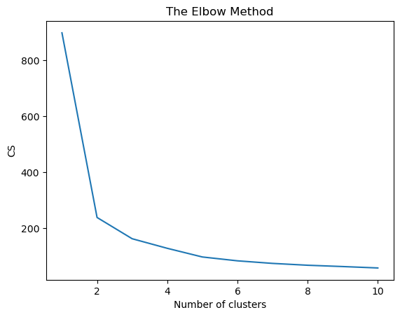
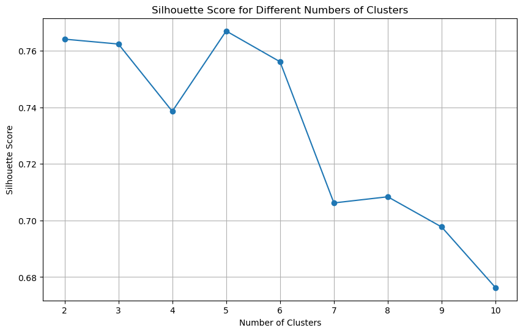

# **Pattern Identification on Facebook Live Sellers | K-Means Clustering**  


## **INTRODUCTION**  
With the rise of **Facebook Live selling**, businesses are leveraging real-time engagement to drive sales. However, identifying distinct **seller patterns** can help optimize marketing strategies and improve business outcomes.  

This project applies **K-Means clustering** to identify patterns among **Facebook Live sellers**, grouping them based on key metrics such as engagement, sales volume, and audience interaction.  

## **PROBLEM STATEMENT**  
Facebook Live sellers operate in a **diverse ecosystem**, with varying levels of engagement, sales, and customer interactions. The goal of this project is to:  
- **Identify unique seller patterns** using unsupervised learning.  
- **Segment sellers into meaningful clusters** based on data-driven insights.  
- **Visualize the clustering results** for better interpretability.  

## **SKILL DEMONSTRATION**  
- **Data Preprocessing & Cleaning**  
- **Unsupervised Learning (K-Means Clustering)**  
- **Cluster Visualization & Interpretation**  
- **Feature Engineering & Scaling**  

## **DATA SOURCING**  
- Dataset containing **Facebook Live seller metrics**, such as:  
  - **Viewer engagement (likes, comments, shares).**  
  - **Sales conversion rates.**  
  - **Stream duration and audience retention.**  

## **DATA PREPROCESSING**  
- **Handling Missing Data:** Removal or imputation of missing values.  
- **Feature Scaling:** Standardizing numerical features for optimal clustering.  
- **Dimensionality Reduction:** Selecting key features for effective clustering.  

## **MODELLING: K-MEANS CLUSTERING**  
- **Optimal Cluster Selection:** Using **Elbow Method** to determine the best K-value.  
- **Training the K-Means Model:** Assigning sellers to distinct groups.  
- **Interpreting Clusters:** Analyzing characteristics of each cluster.


  
## **ANALYSIS & VISUALIZATION**  
- **2D Scatter Plot of Clusters:** Visualizing how sellers are grouped.  
- **Cluster Centers Identification:** Marking central points of each group.  
- **Insights from Each Cluster:** Understanding what makes each seller type unique.  



### **Cluster Visualization Example**
```python
import matplotlib.pyplot as plt
import seaborn as sns

plt.figure(figsize=(8, 6))
sns.scatterplot(x=X[:, 0], y=X[:, 1], hue=kmeans.labels_, palette='viridis', s=50, alpha=0.7)

# Mark cluster centers
centers = kmeans.cluster_centers_[:, :2]
plt.scatter(centers[:, 0], centers[:, 1], c='red', marker='X', s=200, label='Cluster Centers')

plt.title("K-Means Clustering of Facebook Live Sellers")
plt.xlabel("Feature 1")
plt.ylabel("Feature 2")
plt.legend()
plt.show()
```

## **CONCLUSION**  
- **Different seller types can be identified using clustering.**  
- **Data-driven insights help businesses optimize marketing efforts.**  
- **K-Means clustering provides valuable segmentation for targeted strategies.**  
